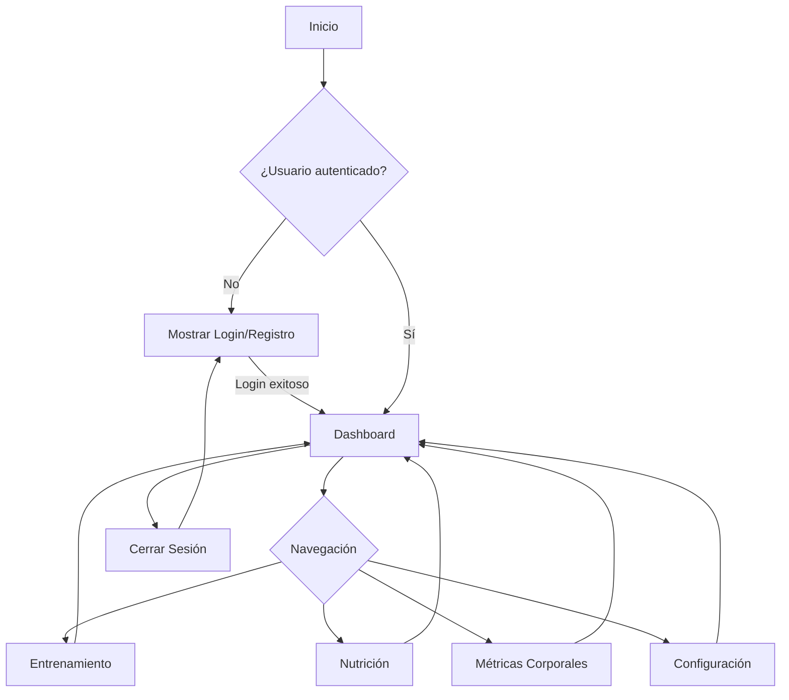
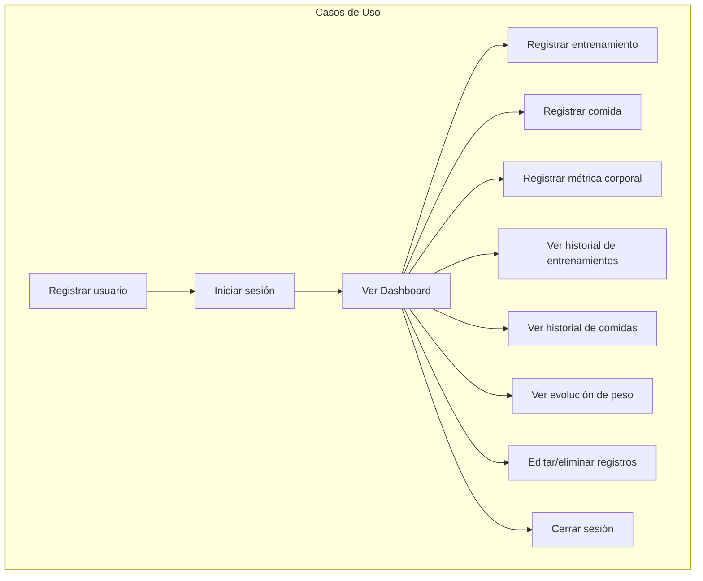

# Sistema de Seguimiento de Entrenamiento y Nutrición

## Descripción
Aplicación web para el seguimiento integral de entrenamiento físico, nutrición y métricas corporales, desarrollada con Python, Streamlit y PostgreSQL.

## Requisitos del Sistema
- Python 3.8+
- PostgreSQL 12+
- pip (gestor de paquetes de Python)

## Configuración del Entorno

1. Clonar el repositorio:
```bash
git clone <url-del-repositorio>
cd <nombre-del-directorio>
```

2. Crear un entorno virtual:
```bash
python -m venv venv
```

3. Activar el entorno virtual:
- Windows:
```bash
.\venv\Scripts\activate
```
- Linux/Mac:
```bash
source venv/bin/activate
```

4. Instalar dependencias:
```bash
pip install -r requirements.txt
```

5. Configurar variables de entorno:
- Crear archivo `.env` en la raíz del proyecto
- Copiar el contenido de `.env.example` y configurar las variables

6. Inicializar la base de datos:
```bash
alembic upgrade head
```

7. Ejecutar la aplicación:
```bash
cd src
streamlit run app.py
```

## Estructura del Proyecto
```
├── alembic/              # Migraciones de base de datos
├── src/                  # Código fuente
│   ├── app.py            # Punto de entrada de la aplicación
│   ├── login.py          # Página de inicio de sesión
│   ├── register.py       # Página de registro de usuario
│   ├── dashboard.py      # Dashboard resumen
│   ├── training.py       # Módulo de entrenamiento
│   ├── metrics.py        # Módulo de métricas corporales
│   ├── nutrition.py      # Módulo de nutrición
│   ├── database/         # Configuración de base de datos
│   └── models/           # Modelos SQLAlchemy
├── tests/                # Tests unitarios y de integración
├── .env.example          # Ejemplo de variables de entorno
├── requirements.txt      # Dependencias del proyecto
└── README.md             # Este archivo
```

## Características Implementadas
- [x] Configuración del entorno de desarrollo
- [x] Autenticación de usuarios (login y registro)
- [x] Dashboard resumen con KPIs
- [x] Módulo de entrenamiento (registro, historial, ejercicios)
- [x] Registro y visualización de métricas corporales (peso, altura, IMC)
- [x] Módulo de nutrición (alimentos, registro de comidas, calorías)

## Flujo de Ejecución
1. El usuario debe iniciar sesión o registrarse para acceder a la aplicación.
2. Una vez autenticado, puede navegar entre las siguientes secciones:
   - Dashboard: KPIs y gráficos de resumen
   - Entrenamiento: registro de entrenamientos y ejercicios
   - Nutrición: registro de comidas y alimentos, historial de calorías
   - Métricas Corporales: registro y evolución de peso, altura e IMC
   - Configuración: (en desarrollo)

## Contribución
1. Crear un branch (`git checkout -b feature/nombre-caracteristica`)
2. Commit de cambios (`git commit -am 'Agregar nueva característica'`)
3. Push al branch (`git push origin feature/nombre-caracteristica`)
4. Crear Pull Request

## Licencia
Este proyecto está bajo la licencia MIT. 

## Diagramas de Flujo y Casos de Uso

### Diagrama de Flujo General



### Diagrama de Casos de Uso



### Casos de Uso Posibles

1. **Registrar usuario:**  Un nuevo usuario crea una cuenta con email, usuario y contraseña.
2. **Iniciar sesión:**  El usuario accede a la app con sus credenciales.
3. **Ver Dashboard:**  El usuario visualiza un resumen de su progreso y KPIs principales.
4. **Registrar entrenamiento:**  El usuario añade un nuevo entrenamiento con ejercicios, series, repeticiones y peso.
5. **Registrar comida:**  El usuario registra alimentos consumidos y la cantidad, calculando calorías.
6. **Registrar métrica corporal:**  El usuario registra su peso y altura, calculando el IMC.
7. **Ver historial de entrenamientos:**  El usuario consulta entrenamientos pasados y detalles.
8. **Ver historial de comidas:**  El usuario consulta comidas registradas y calorías consumidas.
9. **Ver evolución de peso:**  El usuario visualiza la evolución de su peso en el tiempo mediante gráficos.
10. **Editar/eliminar registros:**  El usuario puede modificar o eliminar entrenamientos, comidas o métricas.
11. **Cerrar sesión:**  El usuario sale de la aplicación y debe volver a autenticarse para acceder. 